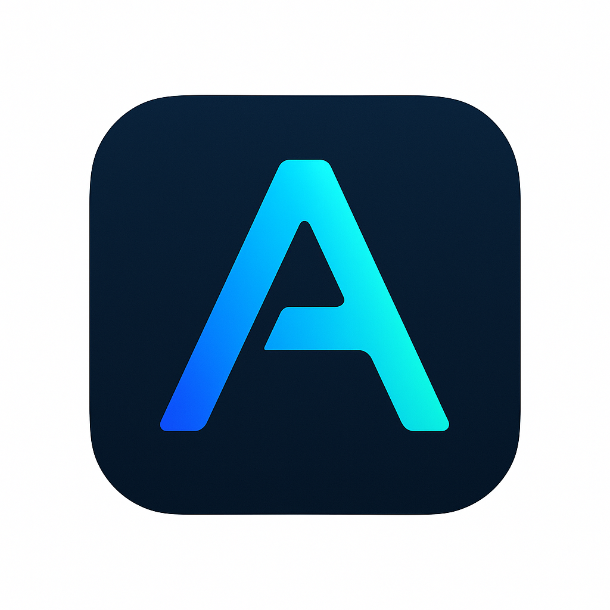

# Aven - Your AI Personal Assistant



<p align="center">
  Transform your productivity with Aven, the AI personal assistant that helps you manage emails, calendar, documents, and more through natural conversation.
</p>

## 🌟 Overview

Aven is an innovative AI-powered personal assistant designed for busy professionals. It streamlines your digital workspace by allowing you to manage emails, schedule meetings, organize documents, and even browse the web in real-time using natural voice or text commands. Say goodbye to juggling multiple apps and tools – Aven brings everything under one conversational interface.

[Live Demo](https://silver-bavarois-7adff0.netlify.app/)

## ✨ Key Features

*   **Voice-First & Text Input**: Interact with Aven using natural voice commands or text input, offering flexibility for any situation.
*   **Smart Productivity Control**: Effortlessly manage your emails (process, reply, summarize, automate), calendar, and documents.
*   **Real-time Web Browsing**: Aven is the first AI assistant to offer native web browsing, providing current information, news, market data, and research on demand.
*   **Contextual AI Intelligence**: Aven learns from your interactions, understanding your communication style and priorities to provide smarter, more personalized assistance.
*   **Universal Tool Integration**: Connect seamlessly with popular productivity tools like Gmail, Google Calendar, Google Docs, Notion, Slack, and more via PicaOS.
*   **Enterprise-Grade Security**: Built with bank-level encryption, SOC 2 compliance, and robust data privacy measures to keep your information secure.
*   **Token-Based Pricing**: A fair, transparent pricing model where you only pay for the AI processing you use. Tokens never expire, and new users receive a generous free token bonus.

## 🚀 Capabilities

Aven leverages cutting-edge AI technologies to deliver its powerful features:

*   **Text to Speech (TTS)**: Powered by ElevenLabs for natural and professional voice responses.
*   **Speech to Text (STT)**: Utilizes ElevenLabs for accurate transcription of your voice commands.
*   **Conversational AI**: Integrates ElevenLabs' advanced conversational AI for fluid and intelligent interactions.
*   **Productivity Automation**: Driven by PicaOS AI to automate tasks across your connected applications.
*   **Tool Integrations**: Connects to over 100+ APIs through PicaOS for comprehensive digital workspace management.
*   **Real-time Information Retrieval**: Uses services like Tavily for up-to-the-minute web search and data.

## 🛠️ Technology Stack

*   **Frontend**:
    *   [Next.js 15 (App Router)](https://nextjs.org/)
    *   [TypeScript](https://www.typescriptlang.org/)
    *   [Tailwind CSS v4](https://tailwindcss.com/)
    *   [shadcn/ui](https://ui.shadcn.com/)
    *   [Framer Motion](https://www.framer.com/motion/) for smooth animations
    *   [React Hook Form](https://react-hook-form.com/) for form management
    *   [React Markdown](https://github.com/remarkjs/react-markdown) for rendering markdown content
    *   [Three.js](https://threejs.org/) for interactive background visuals
*   **Voice AI**:
    *   [ElevenLabs SDK](https://elevenlabs.io/docs)
    *   [`@elevenlabs/react`](https://www.npmjs.com/package/@elevenlabs/react)
*   **Automation & Integrations**:
    *   [PicaOS](https://picaos.com/) (`@picahq/ai`, `@picahq/authkit`, `@picahq/authkit-node`)
*   **Database & Authentication**:
    *   [Supabase](https://supabase.com/) (PostgreSQL, Auth, Edge Functions)
    *   [Iron Session](https://iron-session.vercel.app/) for secure session management
*   **AI Model**:
    *   [DeepSeek AI](https://www.deepseek.com/) (`@ai-sdk/deepseek`)
*   **Utilities**:
    *   [date-fns](https://date-fns.org/) for date manipulation
    *   [Lucide React](https://lucide.dev/) for icons
    *   [Next Themes](https://github.com/pacocoursey/next-themes) for theme management
    *   [Sonner](https://sonner.emilkowal.ski/) for toasts

## 🚀 Getting Started

Follow these steps to set up and run Aven locally.

### Prerequisites

*   [Node.js](https://nodejs.org/en/) (v18.x or higher recommended)
*   [pnpm](https://pnpm.io/) (recommended package manager)

### 1. Clone the Repository

```bash
git clone https://github.com/balojey/kun.git
cd kun # Or the specific path to your project
```

### 2. Environment Variables

Create a `.env` file in the root of your project by copying `.env.example`:

```bash
cp .env.example .env
```

Then, populate the `.env` file with your credentials:

* `ELEVENLABS_API_KEY`: Obtain your API key from ElevenLabs.
* `IRON_SESSION_SECRET_KEY`: Generate a strong, random key (e.g., openssl rand -base64 32).
* `PICA_SECRET_KEY`: Get your secret key from PicaOS.
* `DEEPSEEK_API_KEY`: Your API key for DeepSeek AI.
* `NEXT_PUBLIC_SUPABASE_URL`: Your Supabase project URL.
* `NEXT_PUBLIC_SUPABASE_ANON_KEY`: Your Supabase anonymous public key.
* `NEXT_PUBLIC_PICA_TAVILY_CONNECTION_ID`: (Optional) The connection ID for Tavily if you have it configured in PicaOS.

### 3. Install Dependencies

```bash
pnpm install
```

### 4. Run the Development Server

```bash
pnpm dev
```

Open your browser and navigate to `http://localhost:3000` to see Aven in action.

## 🤝 Contributing

Contributions are welcome! Please refer to the `LICENSE` file for details on how you can contribute to this project.

## 📄 License

This project is licensed under the MIT License. See the `LICENSE` file for more details.